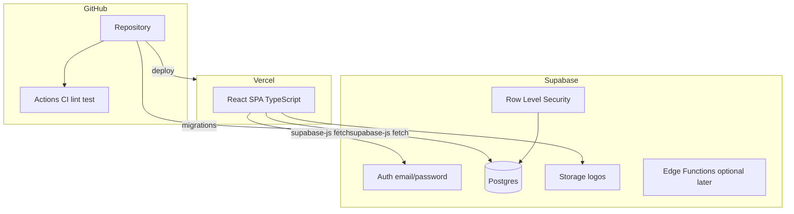

# Implementation plan — Cherry MVP v1

**Stack:** GitHub · Supabase (Postgres + Auth + Storage) · Vercel (React + TypeScript)  
**PRD:** [prd/mvp-v1.md](prd/mvp-v1.md) · **Constraints:** [technical-constraints.md](technical-constraints.md)

---

## Opinion on your approach

Starting with **database schema + authentication**, then layering features, is the right order for this MVP.

| Why it works | Detail |
|--------------|--------|
| Single owner, internal app | Supabase Auth + Row Level Security (RLS) gives you security without a custom Node API for v1 |
| Fits PRD | Customers, estimates, products, and reports all hang off the same `user_id` tenant model |
| Fast iteration on Vercel | Frontend deploys on every push; Supabase migrations version the database |
| Cost | Supabase free tier + Vercel hobby tier are enough for one owner and pilot users |

**Recommendation:** For v1, use a **Supabase-backed SPA** on Vercel (`@supabase/supabase-js` uses `fetch`, not axios). Add **Supabase Edge Functions** only when you need server-side PDF generation or secrets—not in phase 1.

**Design the full schema in phase 1** (tables you will not use until later can stay empty). That avoids painful refactors when estimates and reports land.

---

## Target architecture



| Layer | Choice |
|-------|--------|
| Frontend | Vite + React 18+ + TypeScript + React Router |
| Data access | `@supabase/supabase-js` (no axios) |
| Styling | Tailwind CSS or existing preference (decide in phase 0) |
| Forms / validation | React Hook Form + Zod |
| i18n | `react-i18next` (EN + PT-BR) — phase 6, strings from day 1 where cheap |
| PDF | `@react-pdf/renderer` or browser print-to-PDF in phase 5; Edge Function if layout is too heavy client-side |
| CI | GitHub Actions: `lint`, `typecheck`, `test` on PR |
| CD | Vercel: preview per PR, production on `main` |
| DB changes | Supabase CLI migrations in `supabase/migrations/` |

---

## Repository layout (proposed)

```
cherry-app-saas/
├── .github/workflows/ci.yml
├── apps/web/                 # React app (Vercel root)
│   ├── src/
│   │   ├── features/         # customers, estimates, products, reports, settings
│   │   ├── lib/supabase.ts
│   │   └── ...
│   └── package.json
├── supabase/
│   ├── migrations/
│   └── config.toml
├── docs/
└── package.json              # optional npm workspaces root
```

---

## Data model (phase 1 — implement in migrations)

All business tables include `user_id uuid references auth.users(id)` and RLS: `user_id = auth.uid()`.

### Core tables

| Table | Purpose |
|-------|---------|
| `profiles` | Extends auth user (display name, locale default `en`) |
| `business_settings` | Branding: business name, logo path, colors, default currency USD |
| `customers` | name, phone, address, notes, `created_at` |
| `products` | name, `pricing_type` (`fixed` \| `quote_only`), `base_price` nullable, `is_active` |
| `product_option_groups` | e.g. "Size", "Flavor" — `product_id`, `label`, `sort_order` |
| `product_options` | group_id, label, price_delta nullable |
| `estimates` | customer_id, status enum, event_date, party fields, payment flags, totals |
| `estimate_lines` | estimate_id, product_id nullable, description, qty, unit_price, line_total, custom options JSON |
| `estimate_status_history` | optional audit: status, changed_at |

### Enums

- `estimate_status`: `estimate`, `order` (legacy enum labels `in_production`, `ready` may still exist on older DBs but are migrated to `order`)
- `pricing_type`: `fixed`, `quote_only`
- `fulfillment_type`: `delivery`, `pickup` (on estimate)

### Estimate fields (from PRD)

- `guest_count`, `party_occasion`, `delivery_address`, `fulfillment_type`, `notes`
- `event_date` (required on quote — per your PRD update)
- Payment: `accepted_at`, `deposit_received` (50%), `balance_paid`, `payment_method_notes`
- `subtotal`, `discount`, `total` (denormalized for reports; recompute on save)

### Views / functions (phase 6)

- `customer_lifetime_spend` view or RPC
- `sales_by_period` RPC with `start_date`, `end_date`
- `open_estimates` filter `status = 'estimate'`

### Storage

- Bucket `branding` — logo upload, RLS per user folder

---

## Security model

1. **Disable public signup** after owner account exists (Supabase dashboard or invite-only).
2. **RLS on every table** — no access without `auth.uid()`.
3. **Never expose service role key** in the frontend; only `anon` key in Vercel env.
4. **Storage policies** — users read/write only their `{user_id}/*` paths.

---

## Phased delivery

### Phase 0 — Project foundation (½–1 day)

**Goal:** Empty app deploys; Supabase project linked; secrets wired.

- [ ] Create GitHub repo (or use existing), branch protection on `main`
- [ ] Create Supabase project (prod); optional second project for staging later
- [ ] Create Vercel project, connect repo, set root to `apps/web`
- [ ] Env vars on Vercel: `VITE_SUPABASE_URL`, `VITE_SUPABASE_ANON_KEY`
- [ ] Scaffold Vite + React + TypeScript + ESLint + Prettier
- [ ] Add `@supabase/supabase-js`, thin client wrapper in `lib/supabase.ts`
- [ ] GitHub Actions: install, lint, `tsc --noEmit`
- [ ] Update [technical-constraints.md](technical-constraints.md) with stack table

**Exit:** `main` deploys a hello page; CI green.

---

### Phase 1 — Database + authentication (3–5 days) ← **start here**

**Goal:** Owner can sign in; schema exists; RLS enforced.

- [ ] Init Supabase CLI locally; `supabase/migrations` in repo
- [ ] Migration: `profiles`, `business_settings`, enums
- [ ] Migration: `customers` (minimal for auth testing)
- [ ] RLS policies for all tables created so far
- [ ] Auth UI: login, logout, password reset (email)
- [ ] Protected routes; redirect unauthenticated → `/login`
- [ ] Seed script or SQL seed: default product categories (optional)
- [ ] Create Tatiane’s owner account (manual invite or first signup then lock)

**Exit:** Only authenticated owner sees an empty dashboard shell.

---

### Phase 2 — Customers (2–3 days)

**Goal:** Customer list and detail per PRD.

- [ ] Customers CRUD API via Supabase client
- [ ] List: search by name/phone
- [ ] Detail: profile + placeholder for estimates list
- [ ] “New estimate” CTA (navigates to phase 4 flow, can be stub)

**Exit:** Acceptance — CRUD + search + customer page shell.

---

### Phase 3 — Products catalog + dynamic options (3–4 days)

**Goal:** Products with “add option” flexibility from PRD.

- [ ] Products CRUD (`fixed` vs `quote_only`)
- [ ] `product_option_groups` + `product_options` UI (“Add variable” button)
- [ ] Reorder groups/options (sort_order)
- [ ] No photos (per PRD)

**Exit:** Owner can maintain catalog used on estimates.

---

### Phase 4 — Estimates / quotes (5–7 days)

**Goal:** Core product value — replace Canva workflow.

- [ ] Estimate list with filters (status, customer, date)
- [ ] Create/edit: multi-line items, link product or free-text line
- [ ] Party fields + **event date** required
- [ ] Status workflow: Estimate → In Production → Ready
- [ ] Payment flags (accepted, 50%, balance paid) — manual, no gateway
- [ ] Duplicate estimate from existing
- [ ] **10-day rule:** warn or block edit when `event_date - today < 10 days`
- [ ] Totals: subtotal, discount, total (computed client-side, saved to row)

**Exit:** Full quote lifecycle without PDF yet.

---

### Phase 5 — Branding settings + PDF (4–5 days)

**Goal:** Branded PDF download for WhatsApp.

- [ ] Settings page: business name, colors, logo upload (Storage)
- [ ] PDF template using branding + estimate data
- [ ] Download PDF button on estimate detail
- [ ] Preview before download

**Exit:** Owner sends PDF manually on WhatsApp (MVP integration path).

---

### Phase 6 — Reports + income (2–3 days)

**Goal:** Income visibility from PRD (not profit/costs — those stay v2).

- [ ] Sales total by date range (paid / completed estimates — define rule: e.g. `balance_paid` or `status = ready`)
- [ ] Open estimates report
- [ ] Top customers by revenue
- [ ] Simple charts or tables (mobile-friendly)

**Exit:** Reports acceptance criteria met.

---

### Phase 7 — i18n + mobile polish (3–4 days)

**Goal:** EN + PT-BR; iPhone + desktop usable.

- [ ] `react-i18next` namespaces per feature
- [ ] Language switcher in shell
- [ ] Responsive layouts for list/detail/editor
- [ ] Smoke test on mobile Safari

**Exit:** PRD non-functional criteria.

---

### Phase 8 — Hardening & launch (2–3 days)

- [ ] Error boundaries, toast errors from Supabase
- [ ] Loading/empty states on all lists
- [ ] Backup: confirm Supabase PITR / export process
- [ ] Production checklist with Tatiane (1-week Canva-free trial)
- [ ] Short owner guide in `docs/` (how to login, quote, PDF, reports)

**Exit:** [mvp-v1.md](prd/mvp-v1.md) success criteria.

---

## What we are NOT doing in v1

- Separate Node/Express API (unless Edge Functions prove insufficient)
- WhatsApp API, Stripe, Zelle/Venmo automation
- Costs / profit margins (noted out of scope in PRD)
- Multi-tenant / staff roles
- axios (forbidden)

---

## GitHub + Vercel + Supabase workflow

| Event | Action |
|-------|--------|
| PR opened | GitHub Actions CI; Vercel preview URL |
| PR merged to `main` | Vercel production deploy |
| Schema change | PR includes `supabase/migrations/*.sql`; apply via `supabase db push` (CI step or manual until automated) |

**Later:** GitHub Action to run `supabase db push` on `main` with `SUPABASE_ACCESS_TOKEN` (optional phase 1.5).

---

## Environment variables

| Variable | Where | Purpose |
|----------|-------|---------|
| `VITE_SUPABASE_URL` | Vercel | Supabase project URL |
| `VITE_SUPABASE_ANON_KEY` | Vercel | Public anon key |
| `SUPABASE_SERVICE_ROLE_KEY` | GitHub Actions only (if needed) | Migrations/seeds — never in frontend |
| `SUPABASE_ACCESS_TOKEN` | GitHub Actions (optional) | Remote migrations |

---

## Risks and mitigations

| Risk | Mitigation |
|------|------------|
| RLS misconfiguration exposes data | Test policies with second test user; automated policy tests if possible |
| PDF layout hard on mobile | Preview on desktop; PDF generation async with loading state |
| Scope creep (WhatsApp, costs) | Stick to phased plan; track in GitHub Issues per phase |
| Schema change mid-build | Finalize phase 1 ERD before phase 4; use migrations only |

---

## Suggested immediate next actions (this week)

1. **Phase 0** — scaffold `apps/web`, connect GitHub + Vercel + Supabase.
2. **Phase 1** — write first migration (`profiles`, `business_settings`, `customers`) + RLS + login page.
3. Create GitHub Issues (or Projects) — one milestone per phase above.
4. Optional: add [docs/architecture/erd.md](architecture/erd.md) with Mermaid ERD from the table above.

---

## Timeline estimate (solo developer, part-time)

| Phases | Calendar (rough) |
|--------|------------------|
| 0–1 | Week 1 |
| 2–3 | Week 2 |
| 4 | Weeks 3–4 |
| 5–6 | Week 5 |
| 7–8 | Week 6 |

Adjust if full-time; add buffer for Tatiane feedback after phases 4 and 5.

---

## Open technical decisions (pick in phase 0)

1. **Monorepo** (`apps/web`) vs single package at repo root — monorepo scales better if you add Edge Functions later.
2. **UI kit** — shadcn/ui + Tailwind is a good default for fast internal tools.
3. **PDF library** — decide in phase 5 spike (1 day) before committing.
4. **Income report rule** — count revenue when estimate is `ready` + `balance_paid`, or when 50% received; confirm with Tatiane in phase 6.
